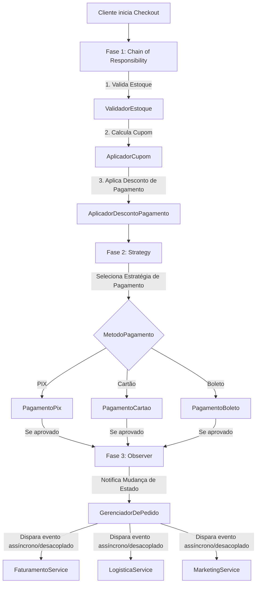

# E-Commerce Checkout API - GoF Design Patterns

Este repositório contém um projeto de alto nível simulando um **Motor de Checkout de E-Commerce**, projetado para consolidar e demonstrar a aplicação prática de padrões de projeto clássicos do **GoF (Gang of Four)** em Java. 

O projeto foi construído seguindo rigorosamente os princípios do **SOLID** e práticas de **Clean Code**, garantindo alta coesão, baixo acoplamento e excelente testabilidade.

---

## Padrões de Projeto Implementados

O fluxo de checkout é composto por três fases sequenciais, cada uma regida por um padrão GoF específico:



---

### 1. Chain of Responsibility (Cadeia de Responsabilidade)
* **Pacote**: `com.ecommerce.checkout.chain`
* **Objetivo**: Processar validações e aplicar descontos acumulativos ordenados sobre o carrinho antes do pagamento.
* **Elos na Cadeia**:
  1. **`ValidadorEstoque`**: Verifica a disponibilidade física dos produtos. Interrompe a cadeia lançando exceção caso falhe.
  2. **`AplicadorCupom`**: Reduz o valor se houver cupons promocionais (ex: `QUERO10`, `DESCONTO20`).
  3. **`AplicadorDescontoPagamento`**: Aplica um desconto adicional de 10% se o método de pagamento selecionado for PIX.

* **Por que usar aqui?**
  Evita blocos gigantescos de validações do tipo `if-else` ou `switch` aninhados. Cada elo tem apenas **uma única responsabilidade** (SOLID SRP) e o pipeline de pré-processamento pode ser reordenado ou estendido (ex: adicionando um validador de fraude) sem alterar a chamada principal no coordenador.

---

### 2. Strategy (Estratégia)
* **Pacote**: `com.ecommerce.checkout.strategy`
* **Objetivo**: Encapsular os algoritmos de transação financeira tornando-os intercambiáveis em tempo de execução.
* **Estratégias Concretas**:
  * **`PagamentoPix`**: Gera chaves dinâmicas Pix (Copia e Cola) e simula autorização instantânea.
  * **`PagamentoCartao`**: Integra com gateway de pagamentos com limites e validações de dados mascarados.
  * **`PagamentoBoleto`**: Registra a cobrança bancária e gera a linha digitável.

* **Por que usar aqui?**
  A forma de efetuar pagamentos é volátil e muda dinamicamente baseada na escolha do usuário. Usar uma interface comum `EstrategiaPagamento` e aplicar o Princípio Aberto/Fechado (SOLID OCP) permite a introdução de novos meios de pagamento (como PicPay ou Criptomoedas) apenas adicionando novas classes sem quebrar o motor de checkout existente.

---

### 3.  Observer (Observador)
* **Pacote**: `com.ecommerce.checkout.observer`
* **Objetivo**: Disparar fluxos e serviços pós-venda totalmente independentes e desacoplados assim que o pagamento do pedido é confirmado.
* **Observadores (Listeners)**:
  * **`FaturamentoService`**: Emite e registra a Nota Fiscal Eletrônica (NF-e) com a SEFAZ.
  * **`LogisticaService`**: Dispara a separação física do estoque e solicita coleta à transportadora.
  * **`MarketingService`**: Envia e-mail de agradecimento e cupom de recompra.

* **Por que usar aqui?**
  Uma vez que o pedido é pago, o core do checkout não precisa e não deve saber como emitir notas fiscais ou enviar e-mails de marketing. A classe `GerenciadorDePedido` atua apenas como o **Sujeito (Subject)**. Ela mantém um registro de observadores genéricos e simplesmente notifica-os sobre a mudança de estado, reduzindo o acoplamento do sistema a zero para essas operações.

---

## Tecnologias e Padrões de Código

- **Linguagem**: Java 17+
- **Gerenciador de Dependências**: Maven 3.x
- **Boas Práticas**:
  - Encapsulamento estrito de propriedades.
  - Uso de Enums tipados para métodos de pagamento.
  - Fluent API para encadeamento fluido de elos da Chain (`definirProximo(...)`).
  - Tratamento de exceções robusto na simulação de falhas de negócios.

---

##  Como Executar o Projeto

Você pode abrir o projeto diretamente em sua IDE de preferência (IntelliJ IDEA, Eclipse ou VS Code) importando-o como um projeto Maven, ou executando através do terminal.

### Pré-requisitos
- JDK 17 ou superior instalado.
- Maven instalado e configurado no PATH.

### Executando pelo Terminal

1. Clone o repositório e navegue até a pasta raiz:
   ```bash
   cd checkout-design-patterns
   ```

2. Compile e empacote o projeto:
   ```bash
   mvn clean package
   ```

3. Execute o JAR gerado (que já contém a classe `Main` configurada no manifesto):
   ```bash
   java -jar target/checkout-design-patterns-1.0-SNAPSHOT-jar-with-dependencies.jar
   ```

*(Alternativamente, você pode rodar a classe principal com o Maven Exec Plugin)*:
```bash
mvn exec:java -Dexec.mainClass="com.ecommerce.checkout.Main"
```

---

## Saída Esperada no Console

Ao executar o programa, a classe `Main` simulará **4 cenários distintos** demonstrando o comportamento dinâmico do sistema:

1. **Cenário 1**: Compra bem-sucedida via PIX com cupom válido `QUERO10`, mostrando o acúmulo de desconto de cupom (10%) + PIX (10%) e o acionamento de todos os observadores pós-venda.
2. **Cenário 2**: Compra bem-sucedida via Cartão de Crédito com cupom `DESCONTO20`, validando a passagem pela cadeia e alteração correta da estratégia de pagamento.
3. **Cenário 3**: Falha no checkout devido a um item simulado sem estoque, provando que a **Chain of Responsibility** interrompeu o fluxo antes do pagamento.
4. **Cenário 4**: Falha no processamento do pagamento via Cartão devido a um valor acima do limite transacional, provando o funcionamento da estratégia em validar e recusar pagamentos.
=======
# Backend_BootCamp_DIO
